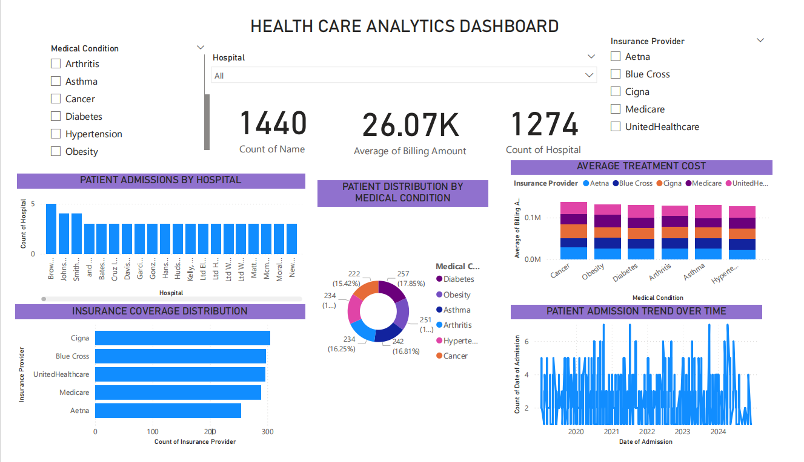

# Healthcare Data Analytics Dashboard

## Project Overview

This project analyzes healthcare patient data to identify trends in hospital admissions, medical conditions, insurance coverage, and treatment costs.
Using **Power BI**, the raw dataset was cleaned, transformed, and visualized to generate actionable insights for healthcare management.

The dashboard helps answer questions such as:

* Which medical conditions are most common?
* Which hospitals receive the most patient admissions?
* How do treatment costs vary by medical condition and insurance provider?
* What trends exist in patient admissions over time?

---

## Tools & Technologies

* **Power BI Desktop** – Data visualization and dashboard creation
* **Power Query** – Data cleaning and transformation
* **Microsoft Excel / CSV** – Dataset storage
* **GitHub** – Version control and project sharing

---

## Dataset

The dataset contains healthcare records including:

* Patient Name
* Age
* Medical Condition
* Hospital
* Insurance Provider
* Billing Amount
* Date of Admission

Each row represents a **patient admission record**.

---

## Data Preparation

The dataset was prepared using Power Query:

* Converted data types (dates, numbers, text)
* Fixed invalid **Date of Admission** values
* Removed rows with conversion errors
* Standardized text formatting
* Loaded cleaned dataset into the Power BI data model

---

## Dashboard Features

The Power BI dashboard includes the following visuals:

* **Donut Chart** – Distribution of patients by medical condition
* **Clustered Column Chart** – Number of patient admissions per hospital
* **Clustered Bar Chart** – Distribution of patients by insurance provider
* **Stacked Column Chart** – Average billing amount by medical condition and insurance provider
* **Line Chart** – Trend of patient admissions over time
* **KPI Cards** – Total patients, average billing amount, and hospital count
* **Interactive Slicers** – Filters for medical condition, insurance provider, and hospital

These visuals allow users to explore healthcare trends interactively.

---

## Key Insights

Some insights observed from the dashboard:

* Certain medical conditions occur more frequently than others.
* A small number of hospitals handle a larger share of patient admissions.
* Insurance providers vary in the number of patients they cover.
* Treatment costs differ depending on the medical condition and insurance provider.
* Patient admissions show variation across different years.

---

## Dashboard Preview



---

## Project Files

```
Healthcare-Data-Analytics
│
├── Healthcare_Dashboard.pbix
├── Sql.csv
├── Queries.xlsx
├── dashboard.png
└── README.md
```

---

## How to Use the Project

1. Download the repository.
2. Open **Healthcare_Dashboard.pbix** using Power BI Desktop.
3. Explore the interactive dashboard and slicers to analyze the data.

---

## Author

Aditya Thakur
